# 🧪 Testament
### AI Accelerator for Intelligent Test Case Generation & UI Automation

> Transforms user stories into executable Playwright test scripts and automated reports — bridging the gap between product requirements and quality assurance.


> 🔒 **This is a private repository.** Source code is not publicly accessible. This README documents the system architecture, capabilities, and business impact.

---

## 📌 Overview

Modern agile teams struggle to keep QA pace with accelerating release cycles. Writing test cases manually from user stories is slow, inconsistent, and hard to scale. Testament solves this.

Testament is an **AI-powered test automation accelerator** that reads user stories — including directly from GitHub issues — and automatically generates structured test cases and fully executable Playwright-compatible scripts. Scripts run against any web URL and produce structured JSON and HTML reports with full traceability back to the original requirement.

---

## 💼 Business Problem

| Challenge | Impact |
|---|---|
| Manual test case writing from user stories | Hours of effort per story |
| Inconsistent interpretation of acceptance criteria | Missed edge cases and gaps |
| Script-writing bottlenecks limiting automation | Low automation coverage |
| Delayed regression testing cycles | Slower releases |
| Fragmented requirement-to-test traceability | Audit and compliance risk |

---

## ✅ What Testament Does

- Ingests **individual user stories** or pulls directly from **GitHub issues**
- AI generates **functional, boundary, edge, and negative test cases**
- Converts scenarios into **executable Playwright-compatible scripts**
- Runs scripts against **any web URL or UI page**
- Generates **JSON** (machine-readable) and **HTML** (dashboard) test reports
- Maintains full **traceability** between user stories and test artifacts

---

## 🔄 End-to-End Workflow

```mermaid
flowchart LR
    A[📋 User Story\nor GitHub Issue] --> B[User Story\nIngestion Layer]

    B --> B1[Manual Input]
    B --> B2[GitHub Integration]
    B --> B3[Acceptance Criteria\nParsing]

    B1 & B2 & B3 --> C[🤖 AI Test Design Engine]

    C --> C1[Natural Language\nUnderstanding]
    C1 --> C2[Scenario Generation\nFunctional · Boundary · Edge · Negative]
    C2 --> C3[Coverage Validation]

    C3 --> D[⚙️ AI Script Generation Engine]

    D --> D1[Playwright-Style\nCode Generation]
    D1 --> D2[Assertion &\nLocator Generation]
    D2 --> D3[Modular Test\nFormatting]

    D3 --> E[🚀 Execution Engine]

    E --> E1[URL-Based Execution\nStaging · Production · Custom]
    E1 --> E2[Headless / Headed\nBrowser Support]
    E2 --> E3[CI/CD Pipeline\nIntegration]

    E3 --> F[📊 Reporting Module]

    F --> F1[JSON Report\nMachine-Readable]
    F --> F2[HTML Report\nInteractive Dashboard]
    F --> F3[Error Trace\n& Audit Logs]
    F --> F4[Traceability Map\nStory → Test → Result]

    style A fill:#1e2230,stroke:#f5c542,color:#e2e8f0
    style C fill:#1e2230,stroke:#2dd4bf,color:#e2e8f0
    style D fill:#1e2230,stroke:#a78bfa,color:#e2e8f0
    style E fill:#1e2230,stroke:#60a5fa,color:#e2e8f0
    style F fill:#1e2230,stroke:#fb7185,color:#e2e8f0
```



---

## 🧱 Technical Stack

| Layer | Technology |
|---|---|
| **User Story Ingestion** | GitHub API, REST, Manual Input |
| **NLP / AI Engine** | LLM (fine-tuned), LangChain |
| **Test Script Generation** | Playwright-compatible Python/JS output |
| **Execution Engine** | Playwright, Headless Chromium |
| **Reporting** | JSON, HTML (custom dashboard) |
| **CI/CD Integration** | GitHub Actions, Jenkins compatible |
| **API Layer** | FastAPI |

---

## 🎯 Core Capabilities

### 1️⃣ AI-Powered Test Case Generation
- Understands user stories and acceptance criteria in natural language
- Identifies functional scenarios, boundary conditions, edge cases, and negative cases
- Converts business logic into structured test design
- Ensures consistent coverage across all stories

### 2️⃣ Executable Script Generation
- Auto-generates Playwright-compatible test scripts
- Handles UI interactions: click, input, validation, navigation
- Generates assertions and locators automatically
- Produces modular, reusable, environment-agnostic test components

### 3️⃣ Test Execution Against Any UI
- Run against staging, production, or any custom URL
- Supports headless and headed browser modes
- Plugs directly into CI/CD pipelines
- Scalable execution for regression suites

### 4️⃣ Automated Reporting
- **JSON report** — machine-readable, CI/CD integration-ready
- **HTML report** — interactive dashboard with pass/fail summary
- Error logs and stack traces captured per test
- Full traceability map from user story → test case → execution result

---

## 📊 Business Impact

| KPI | Result |
|---|---|
| Test Case Authoring Time | **↓ 70–90% reduction** |
| Automation Coverage | **Significantly increased** |
| Regression Cycle Time | **Reduced dramatically** |
| Requirement Traceability | **Fully automated** |
| Release Confidence | **Improved** |

---

## 🔑 Key Differentiators

- **Direct pipeline** — user story → structured test cases → executable scripts, end-to-end
- **GitHub-native** — pulls issues and stories directly via GitHub API
- **AI-generated Playwright scripts** — no manual scripting required
- **Full traceability** — every test artifact linked back to its source requirement
- **CI/CD-ready** — drops straight into existing pipelines
- **Dual reporting** — JSON for machines, HTML for humans

---

## 🚀 Deployment Model

```
┌─────────────────────────────────────────────┐
│           Testament Deployment              │
│                                             │
│  ✅ On-Premise                              │
│  ✅ Private Cloud (AWS / Azure / GCP)       │
│  ✅ Docker containerized                    │
│                                             │
│  Integrations:                              │
│  → GitHub          → Jira (roadmap)         │
│  → GitHub Actions  → Jenkins                │
│  → Any web app URL                          │
│                                             │
│  Output Formats:                            │
│  → JSON test reports                        │
│  → HTML interactive dashboards              │
│  → Audit-ready traceability logs            │
└─────────────────────────────────────────────┘
```

---

## 📁 Repository Structure

```
Testament-Private/
├── main.py                  # Application entry point
├── test_main.py             # Test suite
├── main_latest.py           # Latest stable version
├── utils.py                 # Utility and helper functions
├── requirements.txt         # Dependencies
├── sonar-project.properties # Code quality config
├── coverage.xml             # Test coverage report
└── README.md                # This file
```

---

## 🔒 Privacy & IP Notice

This repository contains proprietary source code developed as part of an enterprise AI accelerator program. The code, architecture, and automation pipelines are **not publicly accessible**.

If you are a recruiter, collaborator, or evaluator and would like a walkthrough or demo, please reach out:

📧 [paularpitaseis@gmail.com](mailto:paularpitaseis@gmail.com)
🔗 [LinkedIn — Arpita Paul](https://www.linkedin.com/in/dr-arpita-paul-575708135/)

---

## 👩‍💻 Author

**Arpita Paul** · Senior Data Scientist · GenAI & LLM Specialist
*From Seismology to GenAI 🚀 | NuSummit | Mumbai*

[](https://github.com/ArpitaAI-collab)
[](https://linkedin.com/in/yourprofile)
